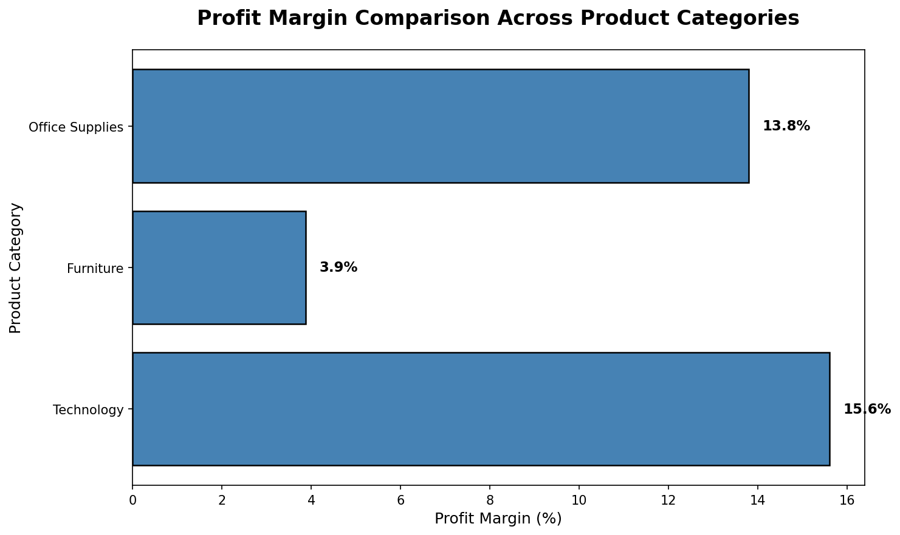
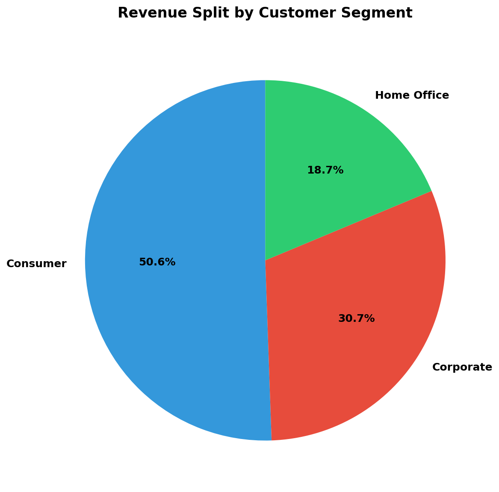

## Executive Summary
I analyzed 9,994 retail transactions ($2.3M revenue) to identify geographic revenue opportunities, optimize product mix, and segment customer behavior for targeted marketing.

## Key Business Findings

 1. Regional Performance Disparity
    
- The West region generates 31% of total revenue ($725K) with strongest profit margins (22%)
- Central region underperforms with negative margins (-10.4%), indicating pricing or cost issues
- **Recommendation:** Expand West region operations; investigate Central region cost structure

 2. Product Category Insights
    
- Technology products deliver 4x better margins than Furniture (15.6% vs 3.9%)
- Top single product: Canon copier generated $25K profit from only 5 units sold
- **Recommendation:** Increase technology inventory allocation; reduce low-margin furniture SKUs

### 3. Customer Segmentation Value

- Consumer segment drives 51% of revenue despite lower average order value ($224)
- Corporate customers show 5% higher order values but smaller market share (31%)
- **Recommendation:** Implement loyalty programs targeting high-volume consumer base

### 4. Seasonal Revenue Patterns

- November-December 2017 peak: $118K monthly revenue (2.5x average)
- Consistent Q4 spikes suggest strong holiday demand
- **Recommendation:** Optimize inventory planning for Q4 surge

## Visualizations

### Revenue by Geographic Region

*West and East regions account for 61% of total revenue*

### Profit Margins Across Categories

*Technology products show consistently superior profitability*

### Customer Segment Distribution

*Consumer segment represents largest revenue opportunity*

### Monthly Revenue Trends

*Clear seasonality with Q4 peaks across all years*

## Technical Implementation

**Data Processing:**
- Python (Pandas) for ETL and data cleaning
- SQL (SQLite) for complex aggregations and business logic queries
- 21 variables analyzed across 4-year time span (2014-2017)

**Analysis Methods:**
- Regional performance comparison (GROUP BY aggregations)
- Product profitability ranking (profit margin calculations)
- Customer lifetime value segmentation
- Time-series trend analysis for forecasting

**Visualizations:**
- Matplotlib for publication-quality charts
- Color-coded insights for stakeholder presentations
- Export-ready PNG files (150 DPI)

## Business Impact Potential

**Estimated Revenue Opportunities:**
- West region expansion: +$150K projected annual revenue (20% growth)
- Technology category focus: +$50K profit through inventory optimization
- Seasonal planning: Reduce stockouts, +15% Q4 revenue capture

**Cost Reduction:**
- Central region margin fix: Recover $40K annual losses
- Furniture SKU reduction: -$20K carrying costs

## Dataset

**Source:** Kaggle Superstore Dataset  
**Size:** 9,994 transactions, 21 variables  
**Download:** [Kaggle Superstore Dataset](https://www.kaggle.com/datasets/vivek468/superstore-dataset-final)

## How to Run
```bash
# Install dependencies
pip install pandas matplotlib

# Download dataset from Kaggle link above
# Place 'Sample - Superstore.csv' in project folder

# Run analysis
python superstore_analysis.py
```

## Author
**Abdoul Rahim Ousseini**  
Northwestern University | CS + Mathematics  
[LinkedIn](https://www.linkedin.com/in/abdoul-rahim-ousseini-246854245/) | [GitHub](https://github.com/abdoulousseini2028-droid)
```

