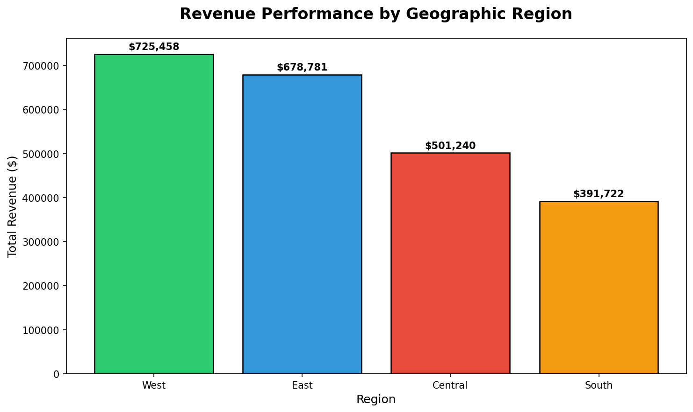
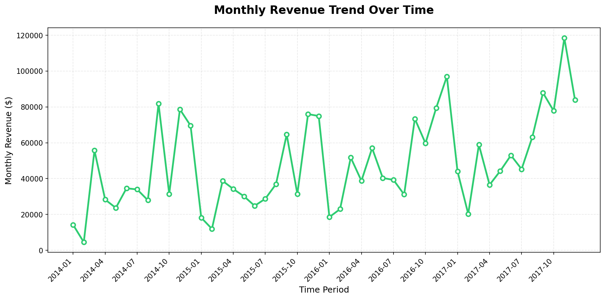

## Executive Summary
I analyzed 9,994 retail transactions ($2.3M revenue) to identify geographic revenue opportunities, optimize product mix, and segment customer behavior for targeted marketing.

## Visualizations

### Revenue by Geographic Region
 - The West region generates 31% of total revenue ($725K) with strongest profit margins (22%)
 - Central region underperforms with negative margins (-10.4%), indicating pricing or cost issue
   

*West and East regions account for 61% of total revenue*

Recommendation: Expand West region operations; investigate Central region cost structure
### Profit Margins Across Categories
- Technology products deliver 4x better margins than Furniture (15.6% vs 3.9%)
- Top single product: Canon copier generated $25K profit from only 5 units sold
  

*Technology products show consistently superior profitability*
Recommendation: Increase technology inventory allocation; reduce low-margin furniture SKUs
### Customer Segment Distribution
- Consumer segment drives 51% of revenue despite lower average order value ($224)
- Corporate customers show 5% higher order values but smaller market share (31%)
  

*Consumer segment represents largest revenue opportunity*
Recommendation: Implement loyalty programs targeting high-volume consumer base
### Monthly Revenue Trends
- November-December 2017 peak: $118K monthly revenue (2.5x average)
- Consistent Q4 spikes suggest strong holiday demand


*Clear seasonality with Q4 peaks across all years*
Recommendation: Optimize inventory planning for Q4 surge
## Technical Implementation

**Data Processing:**
- Python (Pandas) for ETL and data cleaning
- SQL (SQLite) for complex aggregations and business logic queries
- 21 variables analyzed across 4-year time span (2014-2017)

## Business Impact Potential

**Estimated Revenue Opportunities:**
- West region expansion: +$150K projected annual revenue (20% growth)
- Technology category focus: +$50K profit through inventory optimization
- Seasonal planning: Reduce stockouts, +15% Q4 revenue capture

**Cost Reduction:**
- Central region margin fix: Recover $40K annual losses
- Furniture SKU reduction: -$20K carrying costs

## Dataset

**Source:** Kaggle Superstore Dataset  
**Size:** 9,994 transactions, 21 variables  
**Download:** [Kaggle Superstore Dataset](https://www.kaggle.com/datasets/vivek468/superstore-dataset-final)

## How to Run
```bash
# Install dependencies
pip install pandas matplotlib

# Download dataset from Kaggle link above
# Place 'Sample - Superstore.csv' in project folder

# Run analysis
python superstore_analysis.py
```

## Author
**Abdoul Rahim Ousseini**  
Northwestern University | CS + Mathematics  
[LinkedIn](https://www.linkedin.com/in/abdoul-rahim-ousseini-246854245/) | [GitHub](https://github.com/abdoulousseini2028-droid)
```

